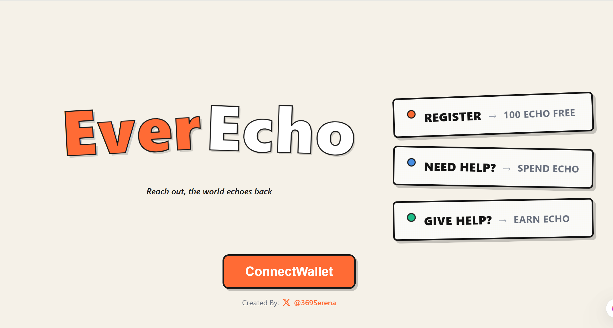
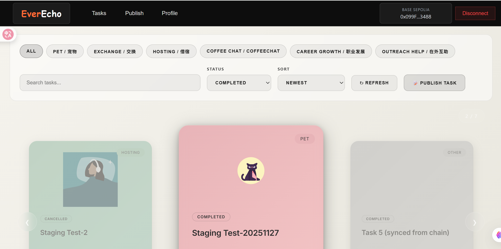
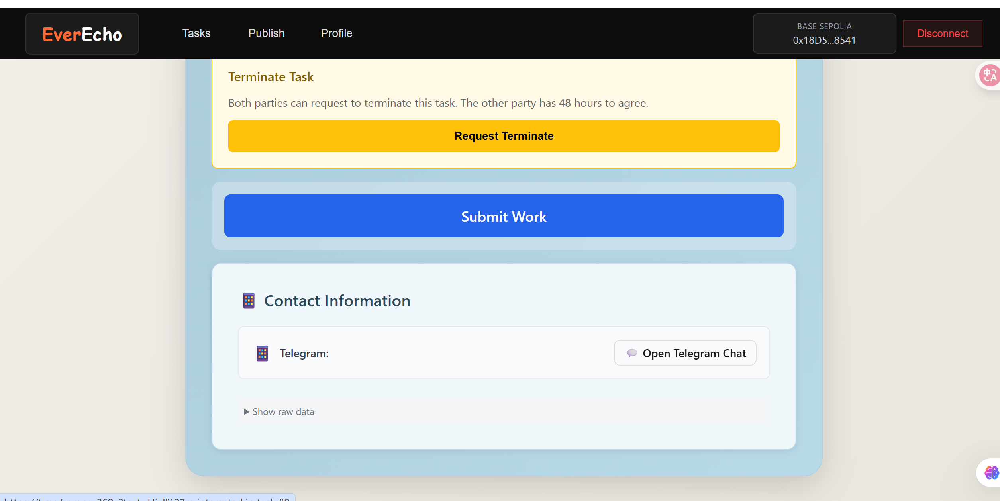
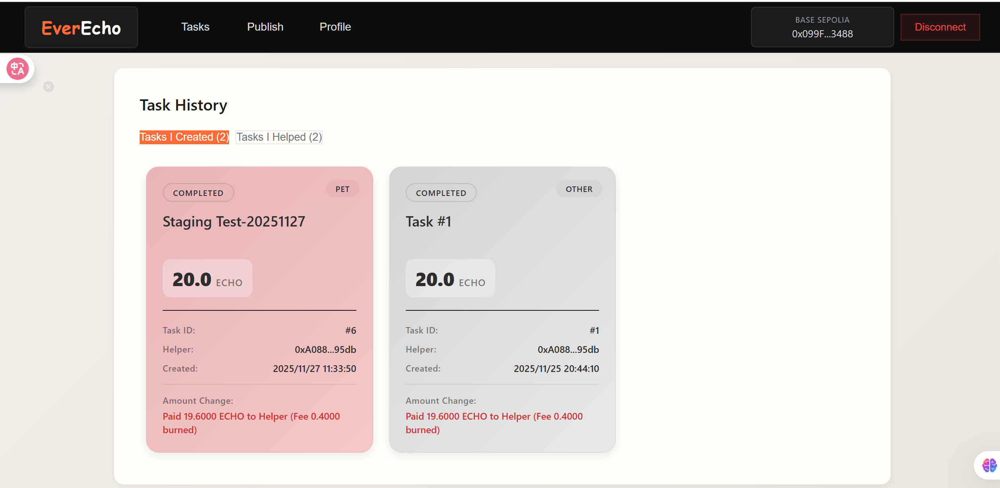

# EverEcho — Web3 Mutual Aid Network

> **Make help echo. Turn social capital into verifiable, circulating value.**  
EverEcho is a Web3-based mutual-aid ecosystem where users earn **ECHO (EOCHO)** tokens by helping others, and spend them to exchange skills, time, or resources. Each act of help becomes a **trusted, on-chain record** that can accumulate into long-term reputation.

---

## ✨ Why EverEcho?

In the Web2 world, help creates value but that value is often:
- **Fragmented**: contributions happen across many places
- **Closed**: locked inside platforms or groups
- **Hard to accumulate**: no long-term incentive layer
- **Hard to trust**: strangers collaboration = high trust cost

EverEcho captures, records, and converts this implicit “social capital” into **visible, usable, and circulating value**, backed by smart contracts.

---

## 🧠 Core Idea

**Help → Earn ECHO → Spend ECHO → More Help**



A self-reinforcing value loop:
- **Creators** post tasks and stake ECHO as rewards.
- **Helpers** accept tasks with **bilateral staking** to prove commitment.
- Smart contracts handle **state transitions**, **escrow**, and **auto settlement**.
- Task collaboration & contacts happen **off-chain** for efficiency and privacy.

---

## 🚀 Features (MVP)

### ✅ Web3 Onboarding
- Connect wallet (MetaMask etc.)
- On-chain `register(profileURI)` as the **only registration entry**
- First-time users receive **100 ECHO initial mint**
- Each address can mint only once
- If supply cap is reached, mint = 0 but registration still succeeds

### ✅ Task Square (Mutual Aid Marketplace)
- Create Task (`Open`)
- Accept Task (`InProgress`) with **helper stake**
- Submit Work (`Submitted`)
- Confirm Complete or Auto Complete (`Completed`)
- Cancel & Timeout protections (`Cancelled`)



### ✅ Bilateral Escrow & Fee Burn
- Creator stakes reward **R**
- Helper stakes **R** (or fixed amount as bond)
- Completion:
  - Helper receives `0.98R`
  - `0.02R` burned as platform fee
  - Helper bond fully refunded


### ✅ Privacy-first Contacts (Off-chain, Encrypted)
- Contacts stored off-chain with **AES-256-GCM**
- Per-task DEK wrapped for both parties using their `encryptionPubKey`
- Contacts visible only after `InProgress` and later states



### ✅ On-chain Contribution History
Profile shows:
- tasks you created
- tasks you helped
- token-in/out changes
- timestamps and status

---

## 🏗️ Architecture

**On-chain**
- `EOCHO Token` (ERC20, cap, initial mint + burn)
- `Register` (registration whitelist + profileURI)
- `TaskEscrow` (task state machine + escrow settlement)

**Off-chain**
- Profile service (stores full profile JSON)
- Task metadata service (stores full task JSON)
- Contacts encryption service (DEK wrapping & access control)

**Frontend**
- Web DApp: Home / Register / Task Square / Task Detail / Profile

---

## 📜 Smart Contracts

### EOCHO Token (ERC20)
- Initial mint on registration (100 ECHO)
- Total supply cap: 10,000,000
- Fee burn callable only by TaskEscrow
- `CapReached` event when cap full

### Register Contract
- `register(string profileURI)` is the **only registration entrance**
- sets `isRegistered[address]`
- stores `profileURI[address]`
- calls `mintInitial(100)` in EOCHO

### TaskEscrow Contract
State machine:
`Open → InProgress → Submitted → Completed / Cancelled`

Key functions:
- `createTask(reward, taskURI)`
- `acceptTask(taskId)`
- `submitWork(taskId)`
- `confirmComplete(taskId)`
- timeouts: `cancelTaskTimeout`, `progressTimeout`, `completeTimeout`
- moderation-lite: `requestFix` (once) + `requestTerminate/agreeTerminate`

---

## 🧰 Tech Stack

- **Solidity** (OpenZeppelin ERC20)
- **React + Tailwind** (Web3 DApp UI)
- **Ethers.js / wagmi / viem** (wallet + contract interaction)
- **Node.js / Express** (profile + task + contacts services)
- **PostgreSQL / MongoDB** (metadata storage)
- **Base / EVM-compatible chain**

---

## 🛠️ Getting Started

### 1) Clone
```bash
git clone https://github.com/your-org/everecho.git
cd everecho


